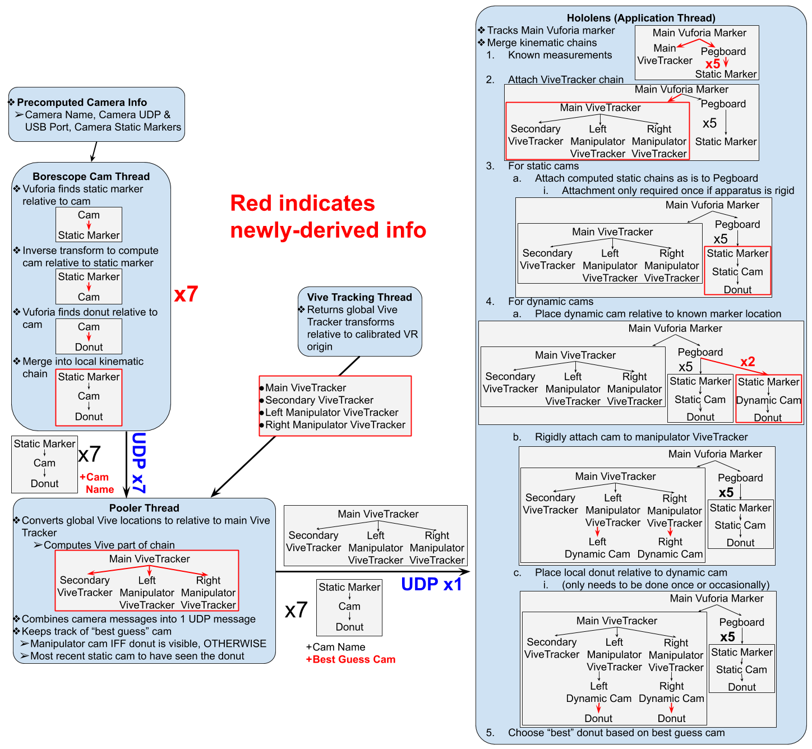

# COMP776Final

In the Hololens Unity project (LaparoHololensAppUnity), the script doing most of the "application thread" kinematic stuff is in LaparoHololensAppUnity/Assets/ViveTrackerPlacer.cs (although quite a bit of it is controlled by the parenting structure in the scene itself)

In the Pooler Thread UE4 project (LaparoViveTrackersPooling), most of the code is in a blueprint script called trackingpawn in LaparoViveTrackersPooling/Content/trackingpawn.uasset (only openable in UE4)

In the individual cam Unity project (LocalCameraPredictionsUnity1-8), the code that does most of the work finding and sending the marker positions through UDP is in LocalCameraPredictionsUnity1/Assets/LaparoCameraManager.cs. Only LaparoHololensAppUnity1 has a REAL Assets directory. The other folders are Unity projects that have a symbolic link to the Assets of LaparoHololensAppUnity1 to trick Unity into thinking they're different projects (Unity will not open multiple of the same project).

Pipeline described here:

More apparatus images
individual cams

static cam kinematic chain

zoom in on local peg

manipulator cam before calib

manipulator cam after calib

virtual pegboard locations

vive tracker positioning

more apparatus

main marker

endoscopes

cam placement
