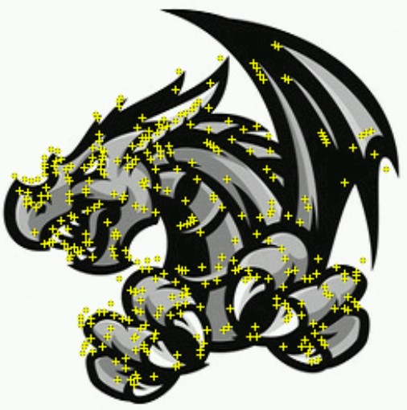
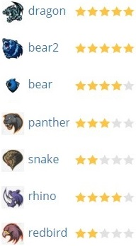
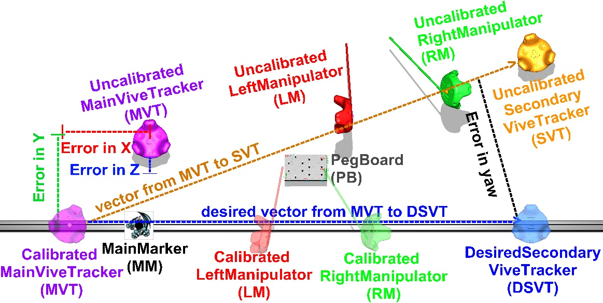
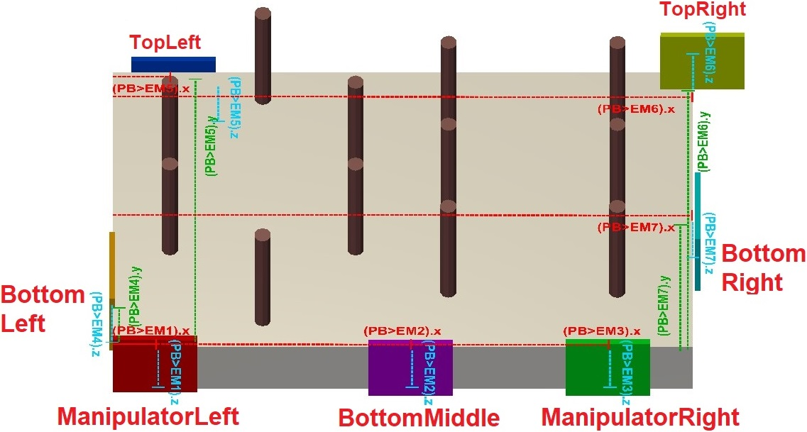
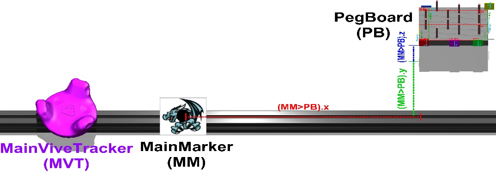
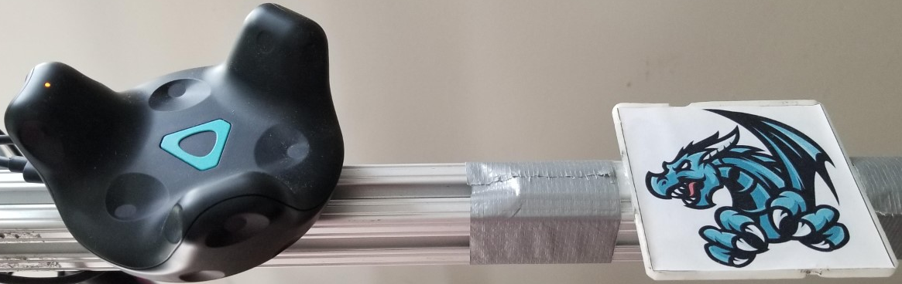
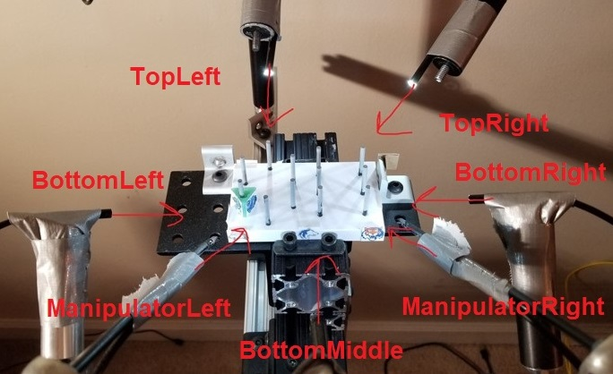

# COMP776Final

In the Hololens Unity project (LaparoHololensAppUnity), the script doing most of the "application thread" kinematic stuff is in LaparoHololensAppUnity/Assets/ViveTrackerPlacer.cs (although quite a bit of it is controlled by the parenting structure in the scene itself). The MagicLeap project is the same as the HoloLens project (it has a symbolic link to most of the HL directories), but its settings are changed to export to MagicLeap correctly.

In the Pooler Thread UE4 project (LaparoViveTrackersPooling), most of the code is in a blueprint script called trackingpawn in LaparoViveTrackersPooling/Content/trackingpawn.uasset (only openable in UE4)

In the individual cam Unity project (LocalCameraPredictionsUnity1-8), the code that does most of the work finding and sending the marker positions through UDP is in LocalCameraPredictionsUnity1/Assets/LaparoCameraManager.cs. Camera info pairing is saved in DefaultLaparoCameraInfo.cs. Only LocalCameraPredictionsUnity1 has a REAL Assets directory. The other folders are Unity projects that have a symbolic link to the Assets of LocalCameraPredictionsUnity1 to trick Unity into thinking they're different projects (Unity will not open multiple of the same project). (makelink is done from within a copied project's folder with "mklink /D Assets ..\LocalCameraPredictionsUnity1\Assets")

Pipeline described here:

More apparatus images

vivetracker

hololens

vuforia features

vuforia image trackability ranks

before translation or yaw correction

after translation, before yaw correction

after correction

entire visualization

individual cams

static cam kinematic chain

zoom in on local peg

manipulator cam before calib

manipulator cam after calib

virtual pegboard locations

vive tracker positioning

more apparatus

main marker

endoscopes/borescopes: https://www.ebay.com/itm/Endoscope-5-5mm-Borescope-Camera-Inspection-For-Android-PC-Laptop-Waterproof-LED/272969087508?hash=item3f8e39ba14:m:mKOxQf8Ih-aXqAamVBQcwWA 

cam placement
